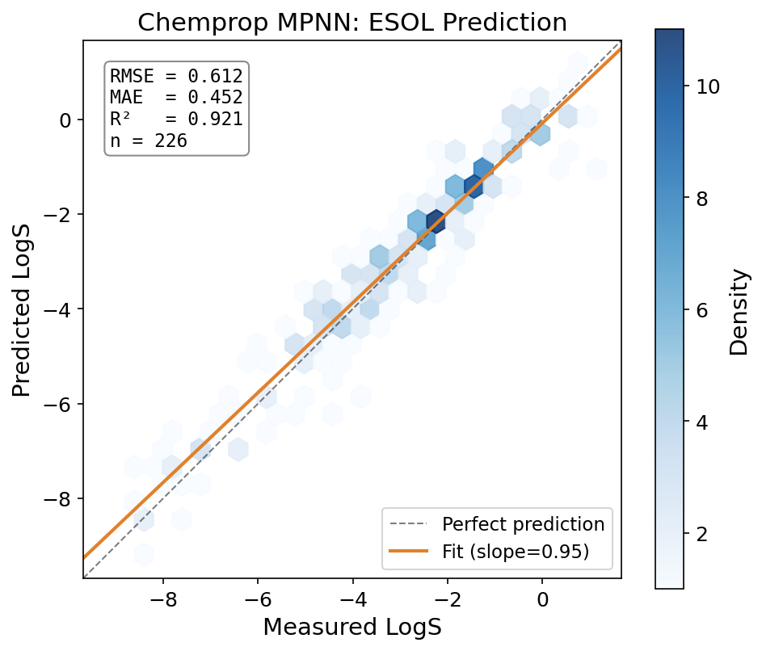
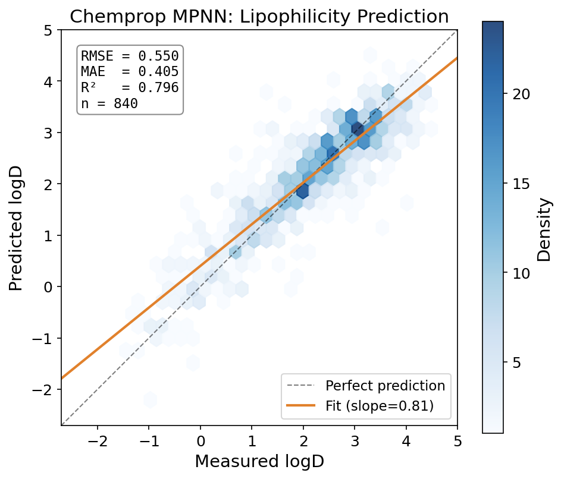
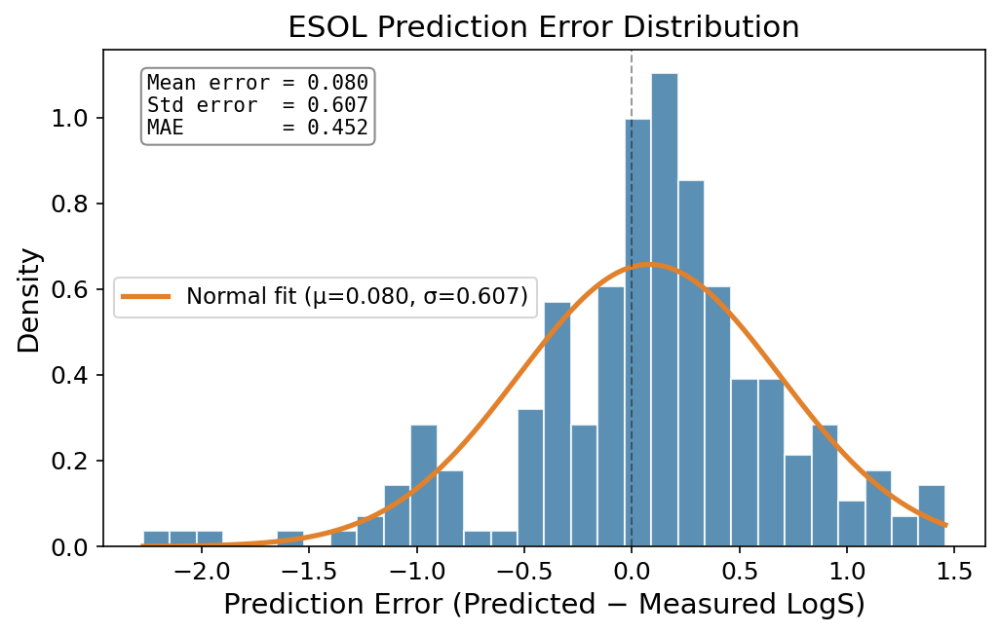
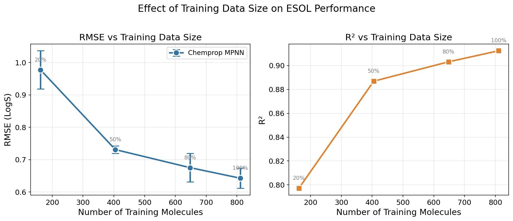
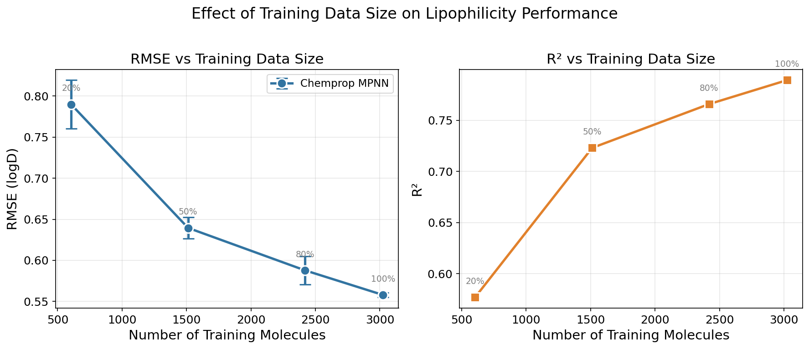
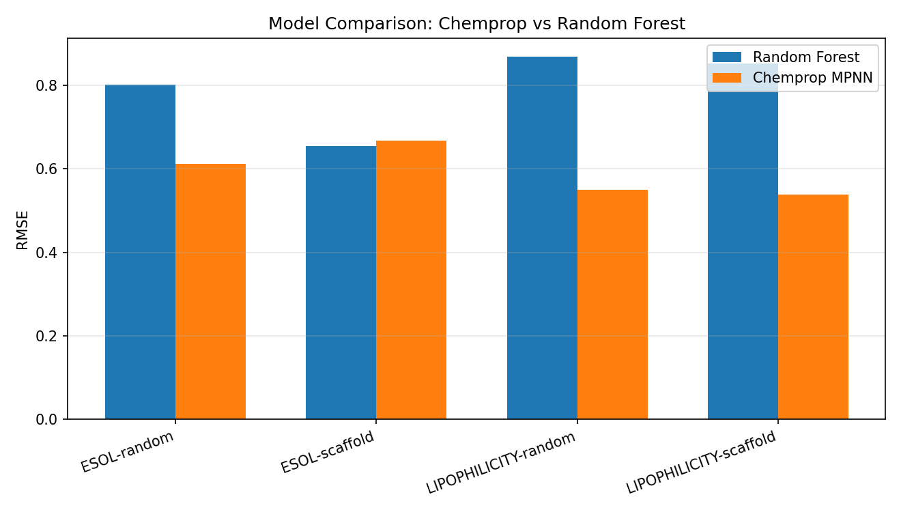
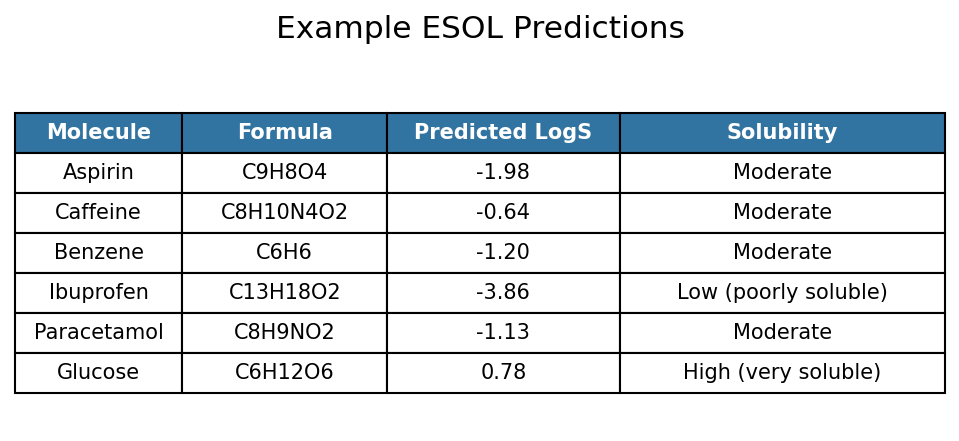

# GitHub Repository

https://github.com/yu2486789817/chemprop-mpp/tree/main

# Abstract

Predicting absorption, distribution, metabolism, excretion and toxicity
(ADMET) related properties directly from molecular structure is a
representative *AI for Science* problem in early drug discovery. In this
report we study how a message passing neural network (Chemprop MPNN)
behaves under different scientific data conditions: dataset size,
molecular property type, modelling paradigm, and the way the
train/test split is constructed. We evaluate two MoleculeNet benchmark
datasets --- ESOL aqueous solubility (1,128 molecules, target $\log S$)
and Lipophilicity (4,200 molecules, target $\log D$) --- against a
traditional RDKit-descriptor Random Forest baseline, under both random
and Bemis--Murcko scaffold splits. On a fixed held-out test set the
Chemprop MPNN reaches $\mathrm{RMSE}=0.612$, $R^2=0.921$ on ESOL and
$\mathrm{RMSE}=0.550$, $R^2=0.796$ on Lipophilicity. Performance
improves monotonically with training-set size on both tasks, the MPNN
outperforms the Random Forest baseline under random splits, and we
observe a clear and *property-dependent* effect of scaffold splitting:
ESOL degrades modestly while Lipophilicity is largely robust. We
discuss what these patterns imply about the reliability of scientific
machine-learning models when chemical coverage is limited.

# 1. Introduction

A central promise of *AI for Science* is to replace slow, expensive
physical measurement with fast, structure-based prediction. In drug
discovery this matters acutely: a candidate molecule must not only bind
its target but also possess acceptable ADMET properties. Two of the
most fundamental such properties are **aqueous solubility** and
**lipophilicity**. Solubility governs whether a compound can dissolve
and be absorbed at all; lipophilicity (commonly summarised by the
distribution coefficient $\log D$) governs membrane permeability and
non-specific binding. The two properties are coupled by a well known
trade-off: too little lipophilicity impairs permeability, while too much
harms solubility and selectivity.

Classical solubility models such as the ESOL equation of Delaney
[1] estimate $\log S$ from a small set of
hand-chosen descriptors. Modern graph neural networks instead *learn*
the molecular representation directly from the molecular graph. The
Chemprop directed message passing neural network of Yang et al.
[2], and its modular successors
[3,4], are
the de-facto open-source standard for this approach.

A single accuracy number on a single dataset, however, says little
about whether such a model is *scientifically reliable*. This report
therefore asks one consolidated research question:

> **How does molecular graph learning perform under different
> scientific data conditions --- namely data scale, molecular property
> type, modelling paradigm, and chemical generalisation split?**

We address this through four coordinated experiments on two datasets,
comparing a learned graph model against a transparent descriptor
baseline, and contrasting random splits against scaffold splits that
emulate the real discovery setting of encountering novel chemotypes.

# 2. Datasets

We use two public MoleculeNet [5] regression
benchmarks. Both are stored in a unified two-column format
(`smiles`, `target`) so that the same training pipeline applies without
hard-coding the target name.

**ESOL (Delaney).** 1,128 organic small molecules with experimentally
measured aqueous solubility $\log S$ ($\log_{10}$ mol/L). Source:
Delaney 2004 [1]. The target ranges from
$-11.60$ to $1.58$ with mean $-3.05$ and standard deviation $2.10$.

**Lipophilicity.** 4,200 drug-like molecules with experimental
octanol/water distribution coefficient $\log D$ at pH 7.4, taken from
the DeepChem/MoleculeNet Lipophilicity CSV. The target ranges from
$-1.50$ to $4.50$ with mean $2.19$ and standard deviation $1.20$.

: Summary of the two benchmark datasets.

| Dataset       | Task                     | Molecules | Target   | Range            | Metrics          |
|---------------|--------------------------|----------:|----------|------------------|------------------|
| ESOL          | Aqueous solubility       |     1,128 | $\log S$ | $[-11.60, 1.58]$ | RMSE, MAE, $R^2$ |
| Lipophilicity | Lipophilicity / $\log D$ |     4,200 | $\log D$ | $[-1.50, 4.50]$  | RMSE, MAE, $R^2$ |

**Splitting strategies.** Each dataset is split 80/20 into
train/test. We construct two kinds of split:

- **Random split.** Molecules are assigned to train/test uniformly at
  random. This tests *interpolation* among chemically similar
  molecules.
- **Scaffold split.** Molecules are grouped by their Bemis--Murcko
  scaffold [6] (RDKit
  `MurckoScaffold.MurckoScaffoldSmiles`); whole scaffold groups are
  assigned to either train or test, largest groups first. This tests
  *generalisation* to chemical skeletons that were never seen during
  training, which is the situation actually faced when screening novel
  series in drug discovery.

After splitting, ESOL yields 902 train / 226 test molecules and
Lipophilicity yields 3,360 train / 840 test molecules. During training
the train portion is further split 90/10 into an internal
training/validation set (e.g.\ ESOL: 811 train / 91 validation).

# 3. Methods

## 3.1 Chemprop MPNN

The primary model is a directed-bond message passing neural network as
implemented in Chemprop v2 [3,4].
Each molecule is represented as a graph whose atoms and bonds carry
feature vectors. The model performs $T$ rounds of bond-centred message
passing; the hidden state of bond $(u\!\to\!v)$ at step $t+1$ is

$$
h_{u\to v}^{(t+1)} \;=\; \tau\!\Big( h_{u\to v}^{(0)} \;+\;
W \!\!\sum_{w \in \mathcal{N}(u)\setminus v} h_{w\to u}^{(t)} \Big),
$$

where $\mathcal{N}(u)$ is the set of neighbours of atom $u$, $W$ a
learned weight matrix and $\tau$ a non-linearity. After $T$ steps the
bond states are aggregated into atom states and then mean-pooled into a
single molecular vector $h_G$, which a feed-forward network maps to the
scalar property. The network is trained end-to-end by minimising the
mean squared error

$$
\mathcal{L} \;=\; \frac{1}{N}\sum_{i=1}^{N}\big(\hat{y}_i - y_i\big)^2 .
$$

Hyper-parameters are held fixed across all datasets and splits to keep
comparisons clean: hidden size $300$, message-passing depth $5$,
dropout $0.1$, batch normalisation enabled, batch size $64$, Adam
optimiser with a plateau learning-rate scheduler, maximum 100 epochs,
and early stopping with patience 15 on the validation loss.

## 3.2 Random Forest baseline

To contrast learned representations against classical feature
engineering, we use a Random Forest regressor
[7] on eight interpretable RDKit
[8] descriptors: molecular weight
(`MolWt`), Crippen $\log P$ (`MolLogP`), topological polar surface area
(`TPSA`), hydrogen-bond donors (`NumHDonors`) and acceptors
(`NumHAcceptors`), rotatable bonds (`NumRotatableBonds`), ring count
(`RingCount`) and the fraction of sp$^3$ carbons (`FractionCSP3`). The
baseline is evaluated on exactly the same train/test molecules as
Chemprop.

## 3.3 Evaluation metrics

For $N$ test molecules with true values $y_i$, predictions $\hat{y}_i$
and mean $\bar{y}$, we report

$$
\mathrm{RMSE}=\sqrt{\tfrac{1}{N}\textstyle\sum_i(\hat y_i-y_i)^2},\quad
\mathrm{MAE}=\tfrac{1}{N}\textstyle\sum_i|\hat y_i-y_i|,\quad
R^{2}=1-\frac{\sum_i(\hat y_i-y_i)^2}{\sum_i(y_i-\bar y)^2}.
$$

## 3.4 Experimental design

We run four experiments: (E1) Chemprop baseline on both datasets under
the random split; (E2) a data-scale experiment training on 20 %, 50 %,
80 % and 100 % of the training pool, three repetitions each with
different seeds, on a fixed test set; (E3) Chemprop vs.\ Random Forest;
and (E4) random split vs.\ scaffold split for both models. A qualitative
case study on common drug molecules complements the quantitative
results.

# 4. Experiments and Results

## 4.1 E1 --- Chemprop baseline on both properties

Table 2 reports the held-out test performance of the Chemprop MPNN
under the random split. The model explains 92 % of the variance in
ESOL solubility and 80 % of the variance in Lipophilicity $\log D$.

: Chemprop MPNN baseline (random split, fixed test set).

| Dataset       | $n_\text{train}$ | $n_\text{test}$ | RMSE  | MAE   | $R^2$ |
|---------------|-----------------:|----------------:|------:|------:|------:|
| ESOL          |              811 |             226 | 0.612 | 0.452 | 0.921 |
| Lipophilicity |            3,024 |             840 | 0.550 | 0.405 | 0.796 |

Figures 1 and 2 show predicted-versus-measured density plots. For ESOL
the fitted slope is 0.95, very close to the ideal diagonal, indicating
almost no systematic bias across four orders of magnitude in
solubility. For Lipophilicity the slope is 0.81, showing mild
*regression to the mean* (high $\log D$ slightly under-predicted, low
$\log D$ slightly over-predicted), consistent with the narrower dynamic
range and the additional physical complexity of $\log D$ (it depends on
the ionisation state of the molecule at a given pH, not only on its
neutral structure).

{width=48%}

{width=48%}

The two tasks are not equally hard. ESOL achieves a higher $R^2$
despite a *larger* RMSE: this is expected because solubility spans a
much wider value range (std $2.10$) than $\log D$ (std $1.20$), so RMSE
alone is not comparable across tasks --- $R^2$ is the fairer
cross-task indicator.

## 4.2 E1b --- Error structure of the baseline model

A single RMSE figure hides *how* a model is wrong. To characterise the
error structure we examined the distribution of the signed residual
$e_i = \hat{y}_i - y_i$ on the ESOL test set (Figure 3). The residuals
are approximately Gaussian, centred almost exactly at zero (mean error
$=0.080$, standard deviation $=0.607$, MAE $=0.452$). The near-zero
mean indicates the model is essentially *unbiased*: it does not
systematically over- or under-predict solubility, consistent with the
fitted slope of $0.95$ in Figure 1. Quantitatively, $67.3\,\%$ of test
molecules are predicted within $\pm0.5$ log units and $88.1\,\%$ within
$\pm1.0$ log unit of the measured value.

{width=48%}

Two observations matter for scientific interpretation. First, the
residual spread ($\sigma\approx0.61$ log units) is comparable to the
experimental reproducibility commonly reported for aqueous-solubility
measurements (often cited at the level of a few tenths of a log unit
[1]). The model error is therefore approaching the
*intrinsic noise floor* of the labels rather than reflecting only model
deficiency --- further accuracy gains would increasingly require cleaner
data, not merely a larger network. Second, the residual tail is mildly
asymmetric: the largest under-prediction reaches $-2.27$ log units
whereas the largest over-prediction is only $+1.46$. The heavier
negative tail corresponds to a few very poorly soluble compounds whose
extreme $\log S$ values are under-represented in training, an
expected small-data coverage effect that re-appears in §4.5.

## 4.3 E2 --- Effect of training-data scale

We trained Chemprop on 20 %, 50 %, 80 % and 100 % of the available
training molecules (three seeds each) against a fixed test set. Table 3
and Figures 4--5 summarise the mean metrics; error bars are the
standard deviation over the three repetitions.

: Data-scale experiment. Values are mean over 3 seeds (RMSE std in parentheses).

| Dataset       | Scale | $n_\text{train}$ | RMSE (std)    | $R^2$ |
|---------------|------:|-----------------:|---------------|------:|
| ESOL          |  20 % |              162 | 0.977 (0.059) | 0.797 |
| ESOL          |  50 % |              405 | 0.731 (0.012) | 0.887 |
| ESOL          |  80 % |              648 | 0.675 (0.044) | 0.903 |
| ESOL          | 100 % |              811 | 0.643 (0.031) | 0.912 |
| Lipophilicity |  20 % |              604 | 0.790 (0.029) | 0.577 |
| Lipophilicity |  50 % |            1,512 | 0.640 (0.013) | 0.723 |
| Lipophilicity |  80 % |            2,419 | 0.588 (0.017) | 0.766 |
| Lipophilicity | 100 % |            3,024 | 0.558 (0.003) | 0.789 |

{width=70%}

{width=70%}

On both tasks, RMSE decreases and $R^2$ increase monotonically with
training size, but with **diminishing returns**: the ESOL RMSE drops
sharply from 20 % to 50 % ($0.977\!\to\!0.731$) and then flattens
($0.675\!\to\!0.643$ from 80 % to 100 %); Lipophilicity shows the same
saturating shape. The variance across seeds also shrinks as more data
is added --- the Lipophilicity RMSE std falls from $0.029$ at 20 % to
$0.003$ at 100 % --- so larger datasets yield not only more accurate
but also more *stable* models. This is the central empirical message of
the project: in molecular property prediction, data quantity is a
first-order determinant of both accuracy and reproducibility.

A useful corollary is the *efficiency* of each additional molecule.
Going from 20 % to 50 % of the ESOL training pool (an extra $243$
molecules) lowers RMSE by $0.246$ log units, i.e. roughly
$1.0\times10^{-3}$ log units per molecule; going from 80 % to 100 % (an
extra $163$ molecules) lowers it by only $0.032$, about
$2.0\times10^{-4}$ per molecule --- a five-fold drop in marginal value.
For a practitioner this quantifies *when data collection stops paying
off* for a given model class, which is itself a scientifically useful
output of the experiment rather than a mere accuracy curve.

## 4.4 E3 --- Chemprop vs. Random Forest

Table 4 and Figure 6 compare the learned graph model against the
descriptor-based Random Forest on identical splits.

: Chemprop MPNN vs. RDKit-descriptor Random Forest.

| Dataset       | Split    | Model         | RMSE  | MAE   | $R^2$ |
|---------------|----------|---------------|------:|------:|------:|
| ESOL          | random   | Random Forest | 0.802 | 0.549 | 0.864 |
| ESOL          | random   | Chemprop MPNN | 0.612 | 0.452 | 0.921 |
| ESOL          | scaffold | Random Forest | 0.654 | 0.494 | 0.899 |
| ESOL          | scaffold | Chemprop MPNN | 0.667 | 0.461 | 0.895 |
| Lipophilicity | random   | Random Forest | 0.869 | 0.642 | 0.489 |
| Lipophilicity | random   | Chemprop MPNN | 0.550 | 0.405 | 0.796 |
| Lipophilicity | scaffold | Random Forest | 0.853 | 0.649 | 0.499 |
| Lipophilicity | scaffold | Chemprop MPNN | 0.538 | 0.400 | 0.801 |

{width=50%}

The learned representation provides a clear advantage under random
splits: Chemprop reduces RMSE by 24 % on ESOL and by 37 % on
Lipophilicity relative to the Random Forest. The gap is *largest on the
larger dataset*: with 3,024 training molecules the MPNN has enough data
to learn a representation that the eight hand-crafted descriptors
cannot match (the Random Forest only reaches $R^2\approx0.49$ on
Lipophilicity). On ESOL the gap is smaller and, under the scaffold
split, the Random Forest and Chemprop are essentially tied
($R^2$ $0.899$ vs.\ $0.895$). This is consistent with the
descriptor-importance analysis: for ESOL the Random Forest places
$\approx 0.81$ of its importance on a single descriptor, Crippen
$\log P$ --- solubility is largely a lipophilicity-driven quantity, so
a model given $\log P$ explicitly is already strong on a small dataset.
For Lipophilicity the importance is spread across $\log P$, TPSA,
molecular weight and FractionCSP3, and no descriptor subset suffices,
which is exactly where the learned model wins.

## 4.5 E4 --- Random split vs. scaffold split

The scaffold split forces the test scaffolds to be disjoint from the
training scaffolds, a much harder and more realistic generalisation
test. For **ESOL**, Chemprop RMSE rises from $0.612$ (random) to
$0.667$ (scaffold) and $R^2$ falls from $0.921$ to $0.895$ --- a
modest, expected degradation: facing unseen skeletons is harder than
interpolating among similar ones. For **Lipophilicity**, by contrast,
Chemprop is essentially unchanged or marginally better under the
scaffold split (RMSE $0.550\!\to\!0.538$, $R^2$
$0.796\!\to\!0.801$). Two factors plausibly explain this
property-dependent behaviour: (i) Lipophilicity is roughly four times
larger, so even after enforcing scaffold disjointness the training set
still covers a broad chemical space; and (ii) $\log D$ is governed more
by bulk physicochemical character (size, polarity, lipophilic surface)
than by the specific ring skeleton, so scaffold novelty hurts it less
than it hurts a skeleton-sensitive property. The Random Forest shows
the same qualitative pattern (ESOL even *improves* under the scaffold
split here, $R^2$ $0.864\!\to\!0.899$), confirming that the effect is a
property/data characteristic rather than a model artefact.

The practical lesson is that average accuracy on a random split can
*over-state* the reliability that a model will deliver on genuinely
novel chemotypes, and that the size of this optimism is itself
property-dependent. Scientific ML models should therefore be reported
with a scaffold-split number, not only a random-split number. We also
note a methodological subtlety: under the scaffold split the ESOL
Random Forest *improves* relative to its own random-split score
($R^2$ $0.864\!\to\!0.899$). This is not the model generalising better
to novel chemotypes; rather, the particular scaffold partition happens
to place a less dispersed set of solubilities in the test fold, so the
$R^2$ denominator (total variance) changes. This illustrates why
scaffold-split numbers should be read together with the predicted-vs-
measured plot and the error distribution (§4.1--4.2), not as a single
scalar --- a recurring theme of this report.

## 4.6 Qualitative case study

As a sanity check we applied the trained ESOL and Lipophilicity models
to ten well-known molecules (Figure 7 shows the ESOL subset). The
predictions follow chemical intuition: highly hydroxylated, hydrophilic
molecules such as glucose are predicted highly soluble
($\log S = +0.78$) and low-lipophilicity ($\log D = -2.20$), whereas
hydrophobic steroids and aromatics such as testosterone
($\log S = -4.82$, $\log D = +3.57$) and tamoxifen
($\log S = -6.24$, $\log D = +3.95$) are predicted poorly soluble and
highly lipophilic. The water/lipid contrast across the two models is
internally consistent. We note that RDKit's $\log P$ and the model's
$\log D$ are not identical concepts --- $\log D$ depends on ionisation
at a given pH --- so disagreement for acidic/basic drugs (e.g.
ibuprofen) is chemically reasonable rather than a model failure.

{width=60%}

# 5. Discussion

**Why more data helps, and why it saturates.** The monotone
improvement in §4.3 reflects the model progressively covering more of
chemical space; the plateau between 80 % and 100 % indicates that, at
this dataset size and model capacity, the marginal molecule carries
little new structural information. The shrinking seed-variance with
scale further shows that small molecular datasets produce not just less
accurate but *less reproducible* models --- an important caveat for
small-data AI-for-Science claims. The per-molecule efficiency estimate
in §4.3 (a five-fold drop in marginal value between the 20→50 % and
80→100 % regimes) turns this qualitative statement into an actionable
one: it tells an experimentalist roughly where additional measurement
effort stops translating into model accuracy for this property and
model class.

**What the error distribution tells us.** The near-Gaussian,
zero-centred ESOL residual (§4.2, $\sigma\approx0.61$) is informative
beyond its RMSE. Because its spread is on the order of the experimental
reproducibility of solubility assays, the model is approaching the
scale of reported experimental variability: the remaining error is
therefore unlikely to be removed by model changes alone and would
increasingly require higher-quality or more consistent measurements.
This reframes the usual "make the model bigger" reflex --- for a mature
benchmark such as ESOL, data quality may be as important as model
capacity. The mild negative-tail asymmetry (worst residual $-2.27$
vs.\ best $+1.46$) localises the residual risk to the sparsely sampled,
very-insoluble extreme, exactly the region a practitioner should treat
with caution.

**Learned vs. engineered representations.** Chemprop's advantage grows
with dataset size and with the chemical complexity of the target. On
small, $\log P$-dominated ESOL, a Random Forest given Crippen $\log P$
is already competitive; on larger Lipophilicity, where no single
descriptor dominates, the learned representation is decisively better.
The transparent baseline is therefore not redundant: it tells us *when*
the expensive model is actually necessary, and its feature-importance
profile (Crippen $\log P$ alone $\approx0.81$ on ESOL versus a flat
profile on Lipophilicity) provides a cheap, interpretable diagnostic of
*why* --- a property whose variance is captured by one descriptor leaves
little headroom for representation learning on a small dataset.

**Chemical generalisation.** The random-vs-scaffold contrast is the
most research-relevant result. It demonstrates that a single accuracy
number is insufficient to certify scientific reliability, and, more
subtly, that the *cost of scaffold novelty is itself
property-dependent*: skeleton-sensitive ESOL degrades while
bulk-property-driven Lipophilicity does not. Reliability is bounded by
data coverage *and* by the physics of the target property. The
denominator artefact noted in §4.5 (the ESOL Random Forest's apparent
scaffold-split *improvement*) reinforces a methodological point: $R^2$
is sensitive to the variance of whichever test fold a split produces,
so robust evaluation should combine a scaffold split with the residual
diagnostics of §4.1--4.2 rather than relying on any single scalar.

**Practical recommendations.** From these results we distil three
concrete guidelines for small-to-medium molecular-property studies:
(i) always report a transparent descriptor baseline alongside the graph
model, which both calibrates the gain and, through feature importance,
explains it; (ii) report a scaffold-split number and an error
distribution, not only a random-split RMSE, because the optimism of
random splits is property-dependent and not knowable a priori; and
(iii) use a data-scale curve to estimate marginal data value before
committing to further data collection.

**Limitations.** All experiments use a single architecture and fixed
hyper-parameters; we did not perform per-dataset tuning, ensembling, or
uncertainty quantification, so the absolute numbers are conservative
rather than state-of-the-art --- the comparisons are controlled, not
optimised. Both datasets are public benchmarks and may contain
measurement noise and assay heterogeneity (particularly $\log D$, which
is pH- and method-dependent). The scaffold split is a proxy for, not a
substitute for, a genuine prospective external test set, and baseline
runs in Tables 2 and 4 are single training runs, so we report point
estimates without significance claims. These are natural directions for
future work.

# 6. Conclusion

We studied a Chemprop message passing neural network across two ADMET
properties, four training-data scales, two modelling paradigms and two
splitting strategies. The MPNN predicts aqueous solubility
($R^2=0.921$) and lipophilicity ($R^2=0.796$) well, improves
monotonically but with diminishing returns as data grows, beats a
descriptor Random Forest under random splits (most decisively on the
larger dataset), and shows a property-dependent --- not catastrophic
--- response to scaffold splitting. The broader message for *AI for
Science* is that data quantity, modelling paradigm and the chosen
evaluation split jointly determine not just the accuracy but the
*trustworthiness* of a scientific predictor. Future work should extend
to more ADMET endpoints, model ensembling with calibrated uncertainty,
and stricter external validation.

# References

\footnotesize

[1] Delaney, J. S. *ESOL: Estimating Aqueous Solubility Directly from
Molecular Structure.* Journal of Chemical Information and Computer
Sciences, 2004, 44(3), 1000--1005. DOI: 10.1021/ci034243x.

[2] Yang, K.; Swanson, K.; Jin, W.; Coley, C.; Eiden, P.; Gao, H.;
Guzman-Perez, A.; Hopper, T.; Kelley, B.; Mathea, M.; et al.
*Analyzing Learned Molecular Representations for Property Prediction.*
Journal of Chemical Information and Modeling, 2019, 59(8), 3370--3388.
DOI: 10.1021/acs.jcim.9b00237.

[3] Heid, E.; Greenman, K. P.; Chung, Y.; Li, S.-C.; Graff, D. E.;
Vermeire, F. H.; Wu, H.; Green, W. H.; McGill, C. J. *Chemprop: A
Machine Learning Package for Chemical Property Prediction.* Journal of
Chemical Information and Modeling, 2024, 64(1), 9--17.
DOI: 10.1021/acs.jcim.3c01250.

[4] Graff, D. E.; Morgan, N. K.; Burns, J. W.; Doner, A. C.; Li, B.;
Li, S.-C.; Manu, J.; Menon, A.; Pang, H.-W.; Wu, H.; Zalte, A. S.;
Zheng, J. W.; Coley, C. W.; Green, W. H.; Greenman, K. P. *Chemprop v2:
An Efficient, Modular Machine Learning Package for Chemical Property
Prediction.* Journal of Chemical Information and Modeling, 2026, 66(1),
28--33. DOI: 10.1021/acs.jcim.5c02332.

[5] Wu, Z.; Ramsundar, B.; Feinberg, E. N.; Gomes, J.; Geniesse, C.;
Pappu, A. S.; Leswing, K.; Pande, V. *MoleculeNet: A Benchmark for
Molecular Machine Learning.* Chemical Science, 2018, 9(2), 513--530.
DOI: 10.1039/C7SC02664A.

[6] Bemis, G. W.; Murcko, M. A. *The Properties of Known Drugs. 1.
Molecular Frameworks.* Journal of Medicinal Chemistry, 1996, 39(15),
2887--2893. DOI: 10.1021/jm9602928.

[7] Breiman, L. *Random Forests.* Machine Learning, 2001, 45(1),
5--32. DOI: 10.1023/A:1010933404324.

[8] Landrum, G. *RDKit: Open-Source Cheminformatics Software.*
https://www.rdkit.org (accessed 2026-05-17).
